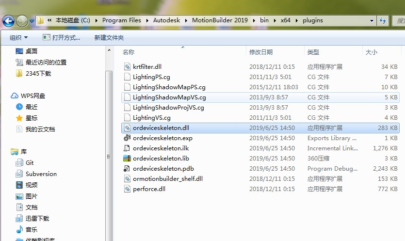
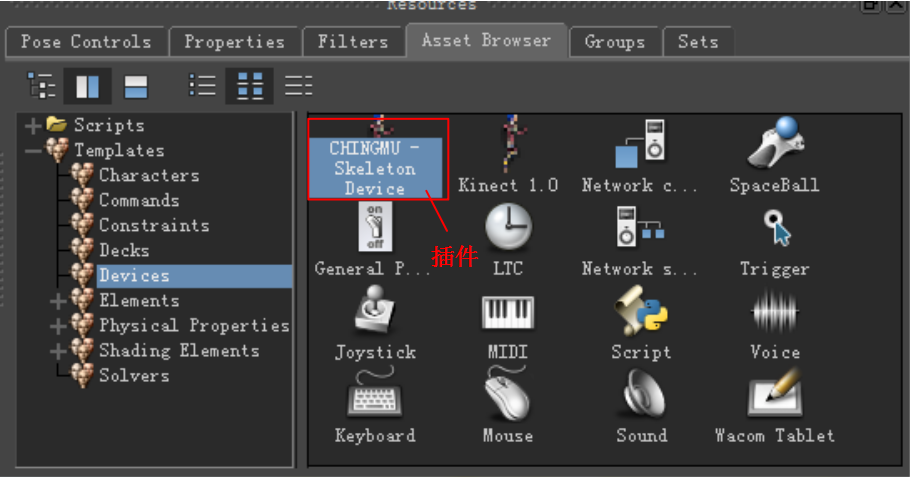
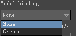
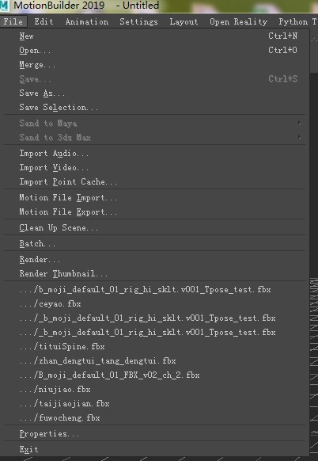
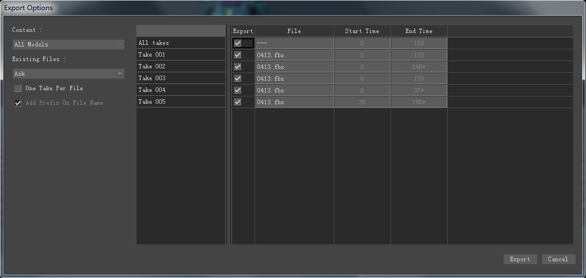

# MotionBuilder-Plugins  
功能描述：实时数据流传输和录制  
版本包括：Motionbuilder 2016-2020以及2022(64-bit)  
数据流包括：实时人物关节数据和刚体的数据（2020及2022版本还包含人物手指关节的数据）

**插件下载：**     
[MotionBuilder2020_Plugin_v1.1](https://github.com/ChingMuVisionTech/MotionBuilder-Plugins/releases/download/v1.1/MotionBuilder2020_v1.1.rar)    
[MotionBuilder2022_Plugin_v1.1](https://github.com/ChingMuVisionTech/MotionBuilder-Plugins/releases/download/2022/MotionBuilder2022_v1.1.rar)    
[MotionBuilder2023_Plugin_v1.1](https://github.com/ChingMuVisionTech/MotionBuilder-Plugins/releases/download/2022/MotionBuilder2023_v1.1.zip)    

## 一、简介  
&emsp;&emsp;本文中介绍的MotionBuilder插件是由上海青瞳视觉自行研发的，此插件可以实时接收青瞳视觉动捕数据。然后通过角色化绑定骨骼,让MotionBuilder场景中的角色跟着青瞳动捕捕捉运动员的动作而运动。此外，还可以将动捕演员的动作录制下来。
## 二、插件的使用
### 1.安装插件

 
  

 
  

图 1-1 插件
 

&emsp;&emsp;如图 1-1 所示，为青瞳视觉自行研发的插件（“CMUnity.dll” “ordeviceskeleton.dll”“ordeviceskeleton.lib”）。将“ordeviceskeleton.dll”和“ordeviceskeleton.lib”放到路径：...\MotionBuilder 2019\bin\x64\plugins下面,将“CMUnity.dll”放到路径：...\MotionBuilder 2019\bin\x64下面。
### 2.插件在 MotionBuilder 2019 中的使用
&emsp;&emsp;启动 MotionBuilder2019（见图 2-1），在 MotionBuilder2019 左下角 Devices 中会生成“CHINGMU-Skeleton Devices”。  

 
  

图 2-1 CHINGMU-Skeleton Devices
  

 
  

图 2-2 参数设置
  

&emsp;&emsp;如图 2-2 所示，将“CHINGMU-Skeleton Devices”拖到 MotionBuilder 场景中，显示 I/O Devices相关信息。在“Model binding”框中点击下拉箭头（见图 2-3），点击“Create” 创建骨骼，在MotionBuilder场景中显示创建的骨骼（见图 2-4）。  

 

图 2-3 创建骨骼
  

 
  

图 2-4 显示骨骼
  

&emsp;&emsp;创建骨骼之后点击图 2-2 中“Characterize”进行角色化，然后将Tutorials中的“mia_rigged”拖到 MotionBuilder场景中（见图 2-5）  

 
  

图 2-5 mia_rigged在MotionBuilder场景中的显示
  

&emsp;&emsp;如图 2-2 所示，在“Use skeleton test”处设置动捕服务器参数。“HostName”：动捕服务器名称；“Address”：运行动捕服务器计算机的IP地址；“HumanID”：动捕服务器新建人物模型的ID号。  
  

图 2-6 实时动捕驱动模型
  

&emsp;&emsp;如图 2-6 所示，设置“Character”为“mia”，设置“source”为“DeviceCharacter”，勾选“Online”，就可以实时动捕驱动MotionBuilder场景中的人物模型了。  

### 3.MotionBuilder 录制数据

 
  

图 3-1 录制数据
 

&emsp;&emsp;如图 3-1 所示，在录制数据之前，需勾选“Online”和“Recording”，然后点击“录制按钮”，会弹出如图 3-2 所示的对话框，点击“Create”，弹出如图 3-3 所示的对话框，点击“No”，然后设置录制的帧速，点击“播放按钮”开始录制数据，再次点击“播放按钮”停止录制。停止录制时，MotionBuilder会走进度条（见图 3-4），进度条走完数据就可以被保存下来。  

 
  

图 3-2 创建
 

 
  

图 3-3
 

 
  

图 3-4 录制结束走进度条
 

 
  

图 3-5 播放录制的数据
  

&emsp;&emsp;如图 3-4 所示，待进度条走完，不勾选“Online”，点击播放,可以查看录制的数据效果。  

### 4.导出数据  

 
  

图 4-1 导出
 

&emsp;&emsp;如图 4-1 所示，点击“File”，选择“Motion File Export”，弹出如图 4-2 所示的对话框，然后选择保存文件的路径和文件名称，点击 “保存”，弹出如图 4-3 所示的对话框，选择要导出的“Take”，然 后点击“Export”即可导出文件  

 
  

图 4-2 选择文件保存路径和文件名称
 

 
  

图 4-3 选择“Take”
 
